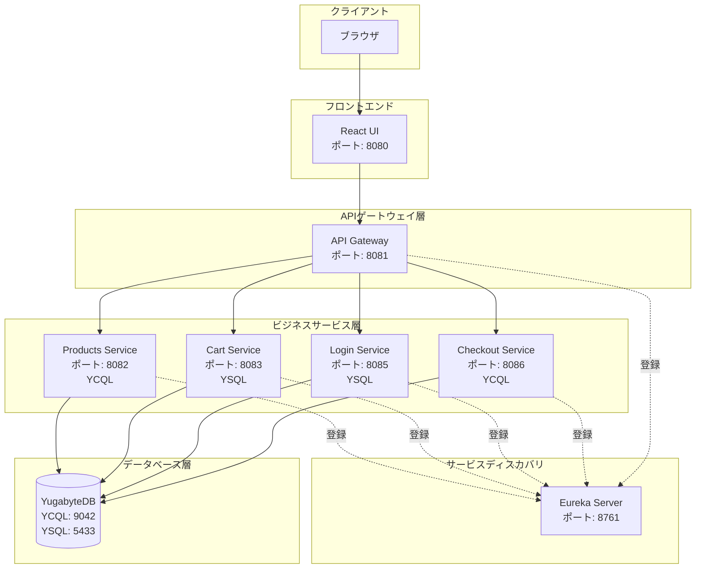

# Yugastore Java


## 目次

- [1. 概要](#1-概要)
- [2. ドキュメント構成](#2-ドキュメント構成)
- [3. システム全体像（アーキテクチャ）](#3-システム全体像アーキテクチャ)
- [4. ディレクトリ構造（標準）](#4-ディレクトリ構造標準)
- [5. 技術スタック](#5-技術スタック)
- [6. クイックスタート（ローカルマシン）](#6-クイックスタートローカルマシン)

## 1. 概要

YugastoreはYugabyteDBを使用したマイクロサービスベースのeコマースマーケットプレイスアプリケーションです。Spring Boot（Java）で構築されたマイクロサービス群とReactベースのUIで構成されています。

### 主要特徴

- **実行方式**: 6つのSpring Bootマイクロサービスで構成され、Eurekaによるサービスディスカバリを使用
- **トランザクション**: YugabyteDBのYCQL（Cassandra互換）とYSQL（PostgreSQL互換）の両APIを活用し、用途に応じた一貫性レベルを実現
- **ログ出力方式**: Spring Bootの標準ロギング機能を使用
- **データ規模**: 6,000件以上の商品データを含むサンプルストア
- **デプロイ方式**: Dockerコンテナによるデプロイに対応

## 2. ドキュメント構成

このリポジトリに含まれるドキュメント構成を以下に示します。

1. **[docs/table_design/table_list.md](docs/table_design/table_list.md) - テーブル設計書（読了時間: 約5分）**
   - テーブル一覧表（orders, product_inventory, product_rankings, products, shopping_cart）
   - ER図（Mermaid形式）

2. **[resources/README.md](resources/README.md) - データロード手順書（読了時間: 約10分）**
   - メタデータのパース方法
   - YugabyteDBへのデータロード手順
   - データクエリのサンプル

3. **[api-gateway-microservice/README.md](api-gateway-microservice/README.md) - APIゲートウェイ説明書（読了時間: 約3分）**
   - 前提条件
   - PCFへのデプロイ手順

4. **[products-microservice/README.md](products-microservice/README.md) - 商品マイクロサービス説明書（読了時間: 約3分）**
   - 前提条件
   - PCFへのデプロイ手順

5. **[react-ui/README.md](react-ui/README.md) - React UIチュートリアル（読了時間: 約30分）**
   - Create React AppとSpring Bootの統合方法
   - フロントエンドとバックエンドの連携
   - Mavenによるパッケージング

6. **[docs/screen-design/screen_list.md](docs/screen-design/screen_list.md) - 画面一覧・画面遷移図（読了時間: 約3分）**
   - 画面一覧表（ホーム画面、商品一覧画面、商品詳細画面、カート画面）
   - 画面遷移図（Mermaid形式）

7. **[docs/screen-design/home.md](docs/screen-design/home.md) - ホーム画面設計書（読了時間: 約10分）**
   - 画面項目定義
   - 画面処理設計
   - 画面レイアウト
   - データマッピング

8. **[docs/screen-design/products.md](docs/screen-design/products.md) - 商品一覧画面設計書（読了時間: 約15分）**
   - 画面項目定義
   - 画面処理設計
   - 画面レイアウト
   - データマッピング

9. **[docs/screen-design/cart.md](docs/screen-design/cart.md) - カート画面設計書（読了時間: 約15分）**
   - 画面項目定義
   - 画面処理設計
   - 画面レイアウト
   - データマッピング

## 3. システム全体像（アーキテクチャ）



### マイクロサービス一覧

| マイクロサービス | YugabyteDB API | ホスト:ポート | 説明 |
| --- | --- | --- | --- |
| サービスディスカバリ | - | localhost:8761 | Eurekaを使用。全マイクロサービスがEurekaに登録し、動的なプロパティ検出に使用 |
| React UI | - | localhost:8080 | eコマースマーケットプレイスのReactベースUI |
| APIゲートウェイ | - | localhost:8081 | 外部APIリクエストを処理。UIはこのサービスとのみ通信 |
| 商品サービス | YCQL | localhost:8082 | 商品カタログ全体を管理。カテゴリ別商品一覧、売上ランキング等を提供 |
| カートサービス | YSQL | localhost:8083 | ショッピングカートへの商品追加を処理。高可用性・低レイテンシが必要 |
| チェックアウトサービス | YCQL | localhost:8086 | チェックアウトプロセスと注文を処理。在庫管理も担当 |
| ログインサービス | YSQL | localhost:8085 | ユーザーのログインと認証を処理 |

## 4. ディレクトリ構造（標準）

```
yugastore-java-kn/
├── README.md                      # プロジェクト概要（本ファイル）
├── pom.xml                        # 親Mavenプロジェクト設定
├── docker-run.sh                  # Dockerコンテナ起動スクリプト
├── yugastore-java-architecture.png # アーキテクチャ図
│
├── api-gateway-microservice/      # APIゲートウェイ（ポート8081）
│   ├── pom.xml
│   ├── Dockerfile
│   └── src/
│
├── cart-microservice/             # カートサービス（ポート8083、YSQL）
│   ├── pom.xml
│   ├── Dockerfile
│   └── src/
│
├── checkout-microservice/         # チェックアウトサービス（ポート8086、YCQL）
│   ├── pom.xml
│   ├── Dockerfile
│   └── src/
│
├── eureka-server-local/           # サービスディスカバリ（ポート8761）
│   ├── pom.xml
│   ├── Dockerfile
│   └── src/
│
├── login-microservice/            # ログインサービス（ポート8085、YSQL）
│   ├── pom.xml
│   ├── Dockerfile
│   └── src/
│
├── products-microservice/         # 商品サービス（ポート8082、YCQL）
│   ├── pom.xml
│   ├── Dockerfile
│   └── src/
│
├── react-ui/                      # React UI（ポート8080）
│   ├── pom.xml
│   ├── frontend/                  # Reactソースコード
│   └── src/                       # Spring Boot静的サーバー
│
├── resources/                     # データベーススキーマとデータロードスクリプト
│   ├── README.md
│   ├── schema.cql                 # YCQL用スキーマ
│   ├── schema.sql                 # YSQL用スキーマ
│   ├── dataload.sh                # データロードスクリプト
│   └── products.json              # 商品データ
│
└── docs/                          # ドキュメント
    ├── table_design/              # テーブル設計書
    │   └── table_list.md
    ├── screen-design/             # 画面設計書
    └── *.png                      # スクリーンショット
```

## 5. 技術スタック

### 5.1 共通

| カテゴリ | 技術 |
| --- | --- |
| **言語** | Java 17 |
| **ビルドツール** | Maven |
| **フレームワーク** | Spring Boot 2.6.3 |
| **クラウドフレームワーク** | Spring Cloud 2021.0.0 |
| **コンテナ** | Docker |
| **データベース** | YugabyteDB（YCQL/YSQL） |
| **データロード** | Python 3 |

### 5.2 各マイクロサービス別

#### サービスディスカバリ（eureka-server-local）

| カテゴリ | 技術 |
| --- | --- |
| **フレームワーク** | Spring Cloud Netflix Eureka Server |
| **ポート** | 8761 |

#### APIゲートウェイ（api-gateway-microservice）

| カテゴリ | 技術 |
| --- | --- |
| **フレームワーク** | Spring Boot + Spring Cloud OpenFeign |
| **ポート** | 8081 |
| **通信** | Feignクライアントによるサービス間通信 |

#### 商品サービス（products-microservice）

| カテゴリ | 技術 |
| --- | --- |
| **フレームワーク** | Spring Boot + Spring Data Cassandra |
| **データベースAPI** | YCQL（Cassandra互換） |
| **ドライバ** | Yugabyte Java Driver 4.6.0-yb-10 |
| **ポート** | 8082 |

#### カートサービス（cart-microservice）

| カテゴリ | 技術 |
| --- | --- |
| **フレームワーク** | Spring Boot + Spring Data JPA |
| **データベースAPI** | YSQL（PostgreSQL互換） |
| **ポート** | 8083 |

#### ログインサービス（login-microservice）

| カテゴリ | 技術 |
| --- | --- |
| **フレームワーク** | Spring Boot + Spring Security + Spring Data JPA |
| **データベースAPI** | YSQL（PostgreSQL互換） |
| **ポート** | 8085 |

#### チェックアウトサービス（checkout-microservice）

| カテゴリ | 技術 |
| --- | --- |
| **フレームワーク** | Spring Boot + Spring Data Cassandra |
| **データベースAPI** | YCQL（Cassandra互換） |
| **ポート** | 8086 |

#### React UI（react-ui）

| カテゴリ | 技術 |
| --- | --- |
| **フロントエンド** | React 16.2.0 |
| **ランタイム** | Node.js 16.13.2 |
| **バックエンド** | Spring Boot（静的ファイル配信） |
| **ビルド統合** | frontend-maven-plugin |
| **ポート** | 8080 |

## 6. クイックスタート（ローカルマシン）

### 6.1 コンテナ起動

#### 前提条件

- Docker がインストールされていること
- YugabyteDB がインストールされ、起動していること

#### ビルド

プロジェクトのルートディレクトリで以下のコマンドを実行します。

```bash
mvn -DskipTests package
```

このコマンドにより、各マイクロサービスのJARファイルとDockerイメージが作成されます。

#### Dockerコンテナの起動

```bash
./docker-run.sh
```

全サービスが[Eurekaダッシュボード](http://127.0.0.1:8761/)に登録されていることを確認してください。

### 6.2 テストデータ格納

#### YCQLテーブルの作成

```bash
cd resources
cqlsh -f schema.cql
```

#### YSQLテーブルの作成

`resources/schema.sql`のSQLを実行してYSQLテーブルを作成します。

#### サンプルデータのロード

```bash
cd resources
./dataload.sh
```

### 6.3 API起動とテスト（オプション）

Dockerを使用せずにホストマシンで直接起動する場合は、以下の順序で各サービスを起動します。

#### ステップ1: Eurekaサービスディスカバリの起動

```bash
cd eureka-server-local/
mvn spring-boot:run
```

[Spring Eureka Service Discovery ダッシュボード](http://localhost:8761/)で起動を確認します。

#### ステップ2: APIゲートウェイの起動

```bash
cd api-gateway-microservice/
mvn spring-boot:run
```

#### ステップ3: 商品サービスの起動

```bash
cd products-microservice/
mvn spring-boot:run
```

#### ステップ4: チェックアウトサービスの起動

```bash
cd checkout-microservice/
mvn spring-boot:run
```

#### ステップ5: カートサービスの起動

```bash
cd cart-microservice/
mvn spring-boot:run
```

#### ステップ6: UIの起動

```bash
cd react-ui/
mvn spring-boot:run
```

マーケットプレイスアプリケーションに[http://localhost:8080/](http://localhost:8080/)でアクセスできます。
