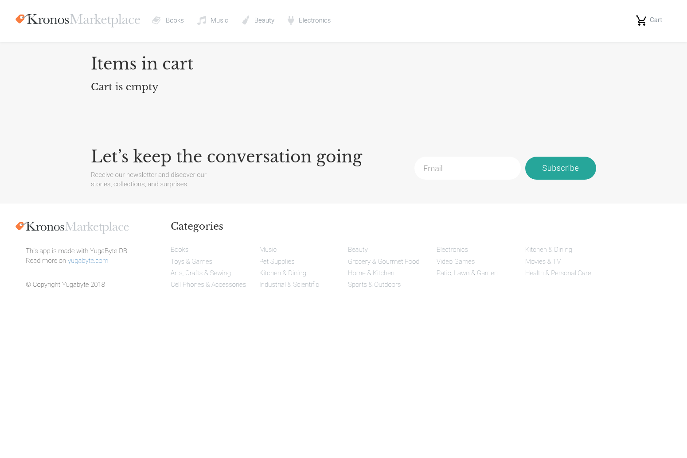

# Cart画面設計書

## 1. 画面項目定義
| No. | 項目名 | 項目名(英語) | 桁数 | 属性 | 必須 | 入力 | 項目種別 | 初期値 | 備考 |
| ---- | ---- | ---- | ---- | ---- | ---- | ---- | ---- | ---- | ---- |
| 1 | ロゴリンク | logo-link | - | - | - | - | NavLink | - | ヘッダー |
| 2 | Booksリンク | books-link | - | - | - | - | NavLink | - | ヘッダー |
| 3 | Musicリンク | music-link | - | - | - | - | NavLink | - | ヘッダー |
| 4 | Beautyリンク | beauty-link | - | - | - | - | NavLink | - | ヘッダー |
| 5 | Electronicsリンク | electronics-link | - | - | - | - | NavLink | - | ヘッダー |
| 6 | カートリンク | cart-link | - | - | - | - | NavLink | - | ヘッダー |
| 7 | 商品詳細リンク | product-detail-link | - | - | - | - | Link | - | リスト項目 |
| 8 | 削除ボタン | btn-cart-remove | - | - | - | - | Button | - | リスト項目 |
| 9 | チェックアウトボタン | checkout-button | - | - | - | - | Button | - | - |
| 10 | メール入力 | email | - | - | - | ○ | FormControl | - | フッター |
| 11 | 購読ボタン | subscribe-button | - | - | - | - | Button | - | フッター |
| 12 | Booksリンク | footer-books-link | - | - | - | - | NavLink | - | フッター |
| 13 | Musicリンク | footer-music-link | - | - | - | - | NavLink | - | フッター |
| 14 | Beautyリンク | footer-beauty-link | - | - | - | - | NavLink | - | フッター |
| 15 | Electronicsリンク | footer-electronics-link | - | - | - | - | NavLink | - | フッター |
| 16 | Kitchen & Diningリンク | footer-kitchen-dining-link | - | - | - | - | NavLink | - | フッター |
| 17 | Toys & Gamesリンク | footer-toys-games-link | - | - | - | - | NavLink | - | フッター |
| 18 | Pet Suppliesリンク | footer-pet-supplies-link | - | - | - | - | NavLink | - | フッター |
| 19 | Grocery & Gourmet Foodリンク | footer-grocery-gourmet-food-link | - | - | - | - | NavLink | - | フッター |
| 20 | Video Gamesリンク | footer-video-games-link | - | - | - | - | NavLink | - | フッター |
| 21 | Movies & TVリンク | footer-movies-tv-link | - | - | - | - | NavLink | - | フッター |
| 22 | Arts, Crafts & Sewingリンク | footer-arts-crafts-sewing-link | - | - | - | - | NavLink | - | フッター |
| 23 | Kitchen & Diningリンク | footer-kitchen-dining-link-2 | - | - | - | - | NavLink | - | フッター |
| 24 | Home & Kitchenリンク | footer-home-kitchen-link | - | - | - | - | NavLink | - | フッター |
| 25 | Patio, Lawn & Gardenリンク | footer-patio-lawn-garden-link | - | - | - | - | NavLink | - | フッター |
| 26 | Health & Personal Careリンク | footer-health-personal-care-link | - | - | - | - | NavLink | - | フッター |
| 27 | Cell Phones & Accessoriesリンク | footer-cell-phones-accessories-link | - | - | - | - | NavLink | - | フッター |
| 28 | Industrial & Scientificリンク | footer-industrial-scientific-link | - | - | - | - | NavLink | - | フッター |
| 29 | Sports & Outdoorsリンク | footer-sports-outdoors-link | - | - | - | - | NavLink | - | フッター |
| 30 | yugabyte.comリンク | yugabyte-link | - | - | - | - | NavLink | - | フッター |

## 2. 画面処理設計
| No. | 項目名 | 処理タイミング | 処理内容 | 備考 |
| ---- | ---- | ---- | ---- | ---- |
| 1 | Cart画面 | Load | 1. `this.props.cart.data`からカート内の商品IDを取得 2. 各商品IDに対して`fetchProductDetails(product_id)`を呼び出し 3. `/products/details?asin={product_id}`にGETリクエストを送信 4. レスポンスを`this.state.products`に追加 | componentDidMount |
| 2 | ロゴリンク | Click | 1. ホーム画面（`/`）に遷移 | ヘッダー |
| 3 | Booksリンク | Click | 1. Books画面（`/Books`）に遷移 | ヘッダー |
| 4 | Musicリンク | Click | 1. Music画面（`/Music`）に遷移 | ヘッダー |
| 5 | Beautyリンク | Click | 1. Beauty画面（`/Beauty`）に遷移 | ヘッダー |
| 6 | Electronicsリンク | Click | 1. Electronics画面（`/Electronics`）に遷移 | ヘッダー |
| 7 | カートリンク | Click | 1. Cart画面（`/cart`）に遷移 | ヘッダー |
| 8 | 商品詳細リンク | Click | 1. 商品詳細画面（`/item/{product.id}`）に遷移 | - |
| 9 | 削除ボタン | Click | 1. `this.props.removeItemFromCart(product)`を呼び出し 2. `/cart/remove/?asin={product.id}`にPOSTリクエストを送信 3. レスポンスで`cart.data`と`cart.total`を更新 | App.jsのremoveItemFromCart |
| 10 | チェックアウトボタン | Click | 1. `this.submitCheckout()`を呼び出し 2. `this.setState({ isCompleted: true })`を実行 3. `/cart/checkout`にPOSTリクエストを送信 4. レスポンスで`result`と`isCompleted`を更新 5. `this.props.fetchCart()`を呼び出してカートを再取得 | cart.totalが0の場合は無効 |
| 11 | メール入力 | Change | 1. 入力値を保持（実装なし） | フッター |
| 12 | 購読ボタン | Click | 1. フォーム送信（実装なし） | フッター |
| 13 | フッターカテゴリリンク | Click | 1. 対応するカテゴリ画面に遷移 | フッター |

## 3. 画面レイアウト

## 4. データマッピング
| No. | 項目名 | bindKey | Ownerコンポーネント | ファイルパス | state種別 | 変数名/パス | 更新API | 初期値 | 永続化 | 備考 |
| ---- | ---- | ---- | ---- | ---- | ---- | ---- | ---- | ---- | ---- | ---- |
| 1 | カート内商品数 | this.props.cart.total | App | react-ui/frontend/src/components/App/index.js | props | cart.total | fetchCart, addItemToCart, removeItemFromCart | 0 | API | - |
| 2 | カートデータ | this.props.cart.data | App | react-ui/frontend/src/components/App/index.js | props | cart.data | fetchCart, addItemToCart, removeItemFromCart | {} | API | - |
| 3 | 商品リスト | this.state.products | CartProducts | react-ui/frontend/src/components/Cart/index.js | local | products | fetchProductDetails | [] | なし | - |
| 4 | チェックアウト完了フラグ | this.state.isCompleted | CartProducts | react-ui/frontend/src/components/Cart/index.js | local | isCompleted | submitCheckout | false | なし | - |
| 5 | チェックアウト結果 | this.state.result | CartProducts | react-ui/frontend/src/components/Cart/index.js | local | result | submitCheckout | undefined | なし | - |
| 6 | 商品ID | product.id | CartProducts | react-ui/frontend/src/components/Cart/index.js | local | products[].id | fetchProductDetails | - | なし | リスト項目 |
| 7 | 商品タイトル | product.title | CartProducts | react-ui/frontend/src/components/Cart/index.js | local | products[].title | fetchProductDetails | - | なし | リスト項目 |
| 8 | 商品価格 | product.price | CartProducts | react-ui/frontend/src/components/Cart/index.js | local | products[].price | fetchProductDetails | - | なし | リスト項目 |
| 9 | 商品画像URL | product.imUrl | CartProducts | react-ui/frontend/src/components/Cart/index.js | local | products[].imUrl | fetchProductDetails | - | なし | リスト項目 |
| 10 | 商品数量 | this.props.cart.data[product.id] | App | react-ui/frontend/src/components/App/index.js | props | cart.data[product.id] | addItemToCart, removeItemFromCart | - | API | リスト項目 |
| 11 | 合計金額 | totalCost | CartProducts | react-ui/frontend/src/components/Cart/index.js | local | - | costReducer | 0 | なし | 計算値 |
| 12 | 注文番号 | this.state.result.orderNumber | CartProducts | react-ui/frontend/src/components/Cart/index.js | local | result.orderNumber | submitCheckout | - | API | チェックアウト後 |
| 13 | 注文詳細 | this.state.result.orderDetails | CartProducts | react-ui/frontend/src/components/Cart/index.js | local | result.orderDetails | submitCheckout | - | API | チェックアウト後 |
| 14 | スクロール状態 | this.props.scrolled | App | react-ui/frontend/src/components/App/index.js | props | scrolled | - | false | なし | ヘッダー |
| 15 | カートエラー状態 | this.props.cart.error | App | react-ui/frontend/src/components/App/index.js | props | cart.error | addItemToCart, removeItemFromCart | false | なし | ヘッダー |
