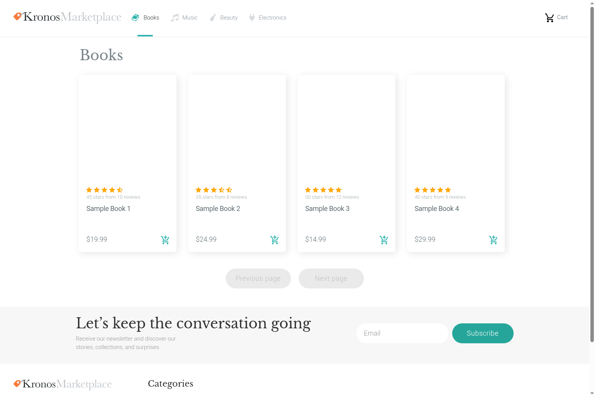

# Products画面設計書

## 1. 画面項目定義
| No. | 項目名 | 項目名(英語) | 桁数 | 属性 | 必須 | 入力 | 項目種別 | 初期値 | 備考 |
| ---- | ---- | ---- | ---- | ---- | ---- | ---- | ---- | ---- | ---- |
| 1 | ロゴリンク | logo-link | - | - | - | - | NavLink | - | ヘッダー |
| 2 | Booksリンク | books-link | - | - | - | - | NavLink | - | ヘッダー |
| 3 | Musicリンク | music-link | - | - | - | - | NavLink | - | ヘッダー |
| 4 | Beautyリンク | beauty-link | - | - | - | - | NavLink | - | ヘッダー |
| 5 | Electronicsリンク | electronics-link | - | - | - | - | NavLink | - | ヘッダー |
| 6 | カートリンク | cart-link | - | - | - | - | NavLink | - | ヘッダー |
| 7 | 商品リンク | product-link | - | - | - | - | Link | - | リスト項目 |
| 8 | カートに追加ボタン | add-to-cart-button | - | - | - | - | button | - | リスト項目 |
| 9 | 前ページボタン | previous-page-button | - | - | - | - | Button | - | - |
| 10 | 次ページボタン | next-page-button | - | - | - | - | Button | - | - |
| 11 | メール入力 | email | - | text | - | ○ | FormControl | - | フッター |
| 12 | 購読ボタン | subscribe-button | - | - | - | - | Button | - | フッター |
| 13 | yugabyte.comリンク | yugabyte-link | - | - | - | - | NavLink | - | フッター |
| 14 | Booksカテゴリリンク | footer-books-link | - | - | - | - | NavLink | - | フッター |
| 15 | Musicカテゴリリンク | footer-music-link | - | - | - | - | NavLink | - | フッター |
| 16 | Beautyカテゴリリンク | footer-beauty-link | - | - | - | - | NavLink | - | フッター |
| 17 | Electronicsカテゴリリンク | footer-electronics-link | - | - | - | - | NavLink | - | フッター |
| 18 | Kitchen & Diningカテゴリリンク | footer-kitchen-dining-link | - | - | - | - | NavLink | - | フッター |
| 19 | Toys & Gamesカテゴリリンク | footer-toys-games-link | - | - | - | - | NavLink | - | フッター |
| 20 | Pet Suppliesカテゴリリンク | footer-pet-supplies-link | - | - | - | - | NavLink | - | フッター |
| 21 | Grocery & Gourmet Foodカテゴリリンク | footer-grocery-gourmet-link | - | - | - | - | NavLink | - | フッター |
| 22 | Video Gamesカテゴリリンク | footer-video-games-link | - | - | - | - | NavLink | - | フッター |
| 23 | Movies & TVカテゴリリンク | footer-movies-tv-link | - | - | - | - | NavLink | - | フッター |
| 24 | Arts, Crafts & Sewingカテゴリリンク | footer-arts-crafts-link | - | - | - | - | NavLink | - | フッター |
| 25 | Home & Kitchenカテゴリリンク | footer-home-kitchen-link | - | - | - | - | NavLink | - | フッター |
| 26 | Patio, Lawn & Gardenカテゴリリンク | footer-patio-lawn-link | - | - | - | - | NavLink | - | フッター |
| 27 | Health & Personal Careカテゴリリンク | footer-health-personal-link | - | - | - | - | NavLink | - | フッター |
| 28 | Cell Phones & Accessoriesカテゴリリンク | footer-cell-phones-link | - | - | - | - | NavLink | - | フッター |
| 29 | Industrial & Scientificカテゴリリンク | footer-industrial-scientific-link | - | - | - | - | NavLink | - | フッター |
| 30 | Sports & Outdoorsカテゴリリンク | footer-sports-outdoors-link | - | - | - | - | NavLink | - | フッター |

## 2. 画面処理設計
| No. | 項目名 | 処理タイミング | 処理内容 | 備考 |
| ---- | ---- | ---- | ---- | ---- |
| 1 | Products画面 | Load | 1. propsまたはURLパラメータからcategoryを取得する 2. categoryをエンコードしてstateに設定する 3. fetchProducts()を呼び出して商品一覧を取得する | componentDidMount |
| 2 | Products画面 | PropsChange | 1. 新しいpropsからcategoryを取得する 2. 現在のcategoryと異なる場合、stateを更新してfetchProducts()を呼び出す | componentWillReceiveProps |
| 3 | Products画面 | fetchProducts | 1. カテゴリに応じてAPIエンドポイントを決定する（`/products/category/{category}?` または `/products?`） 2. limit、offsetパラメータを追加する 3. fetch APIでGETリクエストを送信する 4. レスポンスをJSONとしてパースしてstateに設定する | - |
| 4 | 商品リンク | Click | 1. `/item/{product.id.asin}`に画面遷移する | リスト項目 |
| 5 | カートに追加ボタン | Click | 1. props.addItemToCart(product)を呼び出す 2. 親コンポーネント（App）でfetch APIを使用して`/cart/add?asin={asin}`にPOSTリクエストを送信する 3. レスポンスをJSONとしてパースしてcart stateを更新する | リスト項目 |
| 6 | 前ページボタン | Click | 1. productsを空配列にリセットする 2. fetchProducts()を呼び出す（offset - limit） | - |
| 7 | 次ページボタン | Click | 1. productsを空配列にリセットする 2. isUpdatingをtrueに設定する 3. fetchProducts()を呼び出す（offset + limit） | - |
| 8 | ロゴリンク | Click | 1. `/`（ホーム画面）に画面遷移する | ヘッダー |
| 9 | Booksリンク | Click | 1. `/Books`（Books画面）に画面遷移する | ヘッダー |
| 10 | Musicリンク | Click | 1. `/Music`（Music画面）に画面遷移する | ヘッダー |
| 11 | Beautyリンク | Click | 1. `/Beauty`（Beauty画面）に画面遷移する | ヘッダー |
| 12 | Electronicsリンク | Click | 1. `/Electronics`（Electronics画面）に画面遷移する | ヘッダー |
| 13 | カートリンク | Click | 1. `/cart`（カート画面）に画面遷移する | ヘッダー |
| 14 | 購読ボタン | Click | 1. フォーム送信処理（未実装） | フッター |
| 15 | yugabyte.comリンク | Click | 1. `http://yugabyte.com`に画面遷移する | フッター |
| 16 | フッターカテゴリリンク | Click | 1. `/{category}`に画面遷移する | フッター、リスト項目 |

## 3. 画面レイアウト

## 4. データマッピング
| No. | 項目名 | bindKey | Ownerコンポーネント | ファイルパス | state種別 | 変数名/パス | 更新API | 初期値 | 永続化 | 備考 |
| ---- | ---- | ---- | ---- | ---- | ---- | ---- | ---- | ---- | ---- | ---- |
| 1 | カテゴリ | category | Products | react-ui/frontend/src/components/Products/index.js | local/props | this.state.category / this.props.category / this.props.match.params.category | setState | undefined | なし | propsまたはURLパラメータから取得 |
| 2 | 商品一覧 | products | Products | react-ui/frontend/src/components/Products/index.js | local | this.state.products | fetchProducts | [] | API | /products または /products/category/{category} |
| 3 | 表示件数 | limit | Products | react-ui/frontend/src/components/Products/index.js | local/props | this.state.limit / this.props.limit | fetchProducts | 12 | なし | - |
| 4 | オフセット | offset | Products | react-ui/frontend/src/components/Products/index.js | local/props | this.state.offset / this.props.offset | fetchProducts | 0 | なし | - |
| 5 | 更新中フラグ | isUpdating | Products | react-ui/frontend/src/components/Products/index.js | local | this.state.isUpdating | setState | true | なし | - |
| 6 | 現在のクエリ | current_query | Products | react-ui/frontend/src/components/Products/index.js | local | this.state.current_query | setState | "" | なし | 重複リクエスト防止用 |
| 7 | カート情報 | cart | App | react-ui/frontend/src/components/App/index.js | local | this.state.cart | fetchCart / addItemToCart | {data: {}, total: 0} | API | /cart/get、/cart/add |
| 8 | スクロール状態 | scrolled | App | react-ui/frontend/src/components/App/index.js | local | this.state.scrolled | setState | false | なし | ヘッダー表示制御用 |
| 9 | カート内アイテム数 | itemsInCart | Navbar | react-ui/frontend/src/components/Main/components/NavBar/index.js | local | this.state.itemsInCart | - | 0 | なし | ヘッダー |
| 10 | 商品ID | product.id.asin | Products | react-ui/frontend/src/components/Products/index.js | local | this.state.products[].id.asin | fetchProducts | - | API | リスト項目 |
| 11 | 商品タイトル | product.title | Products | react-ui/frontend/src/components/Products/index.js | local | this.state.products[].title | fetchProducts | - | API | リスト項目 |
| 12 | 商品価格 | product.price | Products | react-ui/frontend/src/components/Products/index.js | local | this.state.products[].price | fetchProducts | - | API | リスト項目 |
| 13 | 商品画像URL | product.imUrl | Products | react-ui/frontend/src/components/Products/index.js | local | this.state.products[].imUrl | fetchProducts | - | API | リスト項目 |
| 14 | 平均星評価 | product.avg_stars | Products | react-ui/frontend/src/components/Products/index.js | local | this.state.products[].avg_stars | fetchProducts | - | API | リスト項目 |
| 15 | 星評価数 | product.num_stars | Products | react-ui/frontend/src/components/Products/index.js | local | this.state.products[].num_stars | fetchProducts | - | API | リスト項目 |
| 16 | レビュー数 | product.num_reviews | Products | react-ui/frontend/src/components/Products/index.js | local | this.state.products[].num_reviews | fetchProducts | - | API | リスト項目 |
