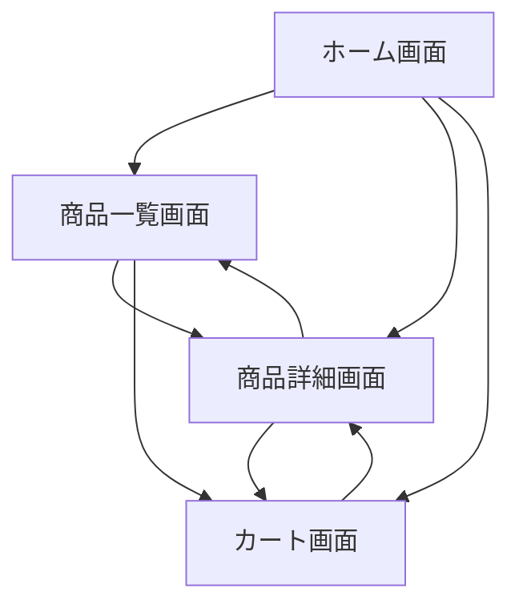

# 画面設計書

## 1. 画面一覧

| No. | 画面名 | 概要 |
| ---- | ---- | ---- |
| 1 | ホーム画面 | - ヒーローバナー表示 - カテゴリ別ベストセラー商品表示（Books、Music、Beauty、Electronics） - 各カテゴリへのリンク |
| 2 | 商品一覧画面 | - カテゴリ別商品一覧表示 - 商品画像、タイトル、価格、レビュー評価表示 - ページネーション機能 - カートへの追加機能 |
| 3 | 商品詳細画面 | - 商品画像表示 - 商品名、価格、説明文表示 - レビュー評価表示 - カートへの追加機能 - 関連商品（Also bought）表示 |
| 4 | カート画面 | - カート内商品一覧表示 - 商品画像、タイトル、価格、数量表示 - 商品削除機能 - 合計金額・税額表示 - チェックアウト機能 - 注文完了メッセージ表示 |

## 2. 画面遷移図

