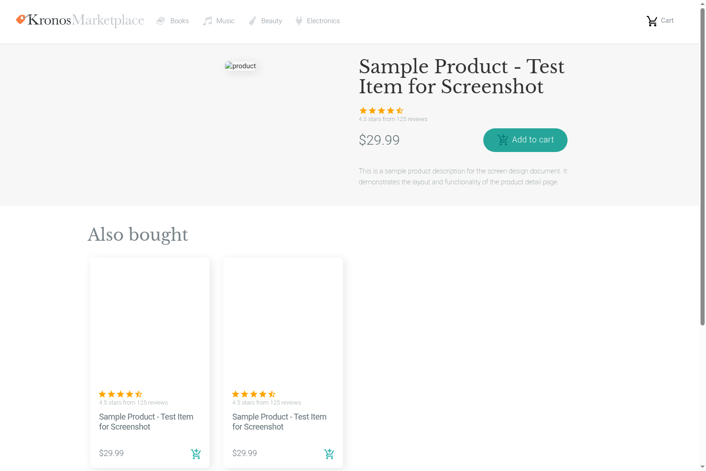

# ShowProduct画面設計書

## 1. 画面項目定義
| No. | 項目名 | 項目名(英語) | 桁数 | 属性 | 必須 | 入力 | 項目種別 | 初期値 | 備考 |
| ---- | ---- | ---- | ---- | ---- | ---- | ---- | ---- | ---- | ---- |
| 1 | ロゴリンク | logo-link | - | - | - | - | NavLink | - | ヘッダー |
| 2 | Booksリンク | books-link | - | - | - | - | NavLink | - | ヘッダー |
| 3 | Musicリンク | music-link | - | - | - | - | NavLink | - | ヘッダー |
| 4 | Beautyリンク | beauty-link | - | - | - | - | NavLink | - | ヘッダー |
| 5 | Electronicsリンク | electronics-link | - | - | - | - | NavLink | - | ヘッダー |
| 6 | カートリンク | cart-link | - | - | - | - | NavLink | - | ヘッダー |
| 7 | カートに追加ボタン | add-to-cart-button | - | - | - | - | Button | - | メイン商品 |
| 8 | 関連商品リンク | also-bought-product-link | - | - | - | - | Link | - | リスト項目 |
| 9 | 関連商品カートに追加ボタン | also-bought-add-to-cart-button | - | - | - | - | button | - | リスト項目 |
| 10 | メール入力 | email | - | text | - | ○ | FormControl | - | フッター |
| 11 | 購読ボタン | subscribe-button | - | - | - | - | Button | - | フッター |
| 12 | yugabyte.comリンク | yugabyte-link | - | - | - | - | NavLink | - | フッター |
| 13 | Booksカテゴリリンク | footer-books-link | - | - | - | - | NavLink | - | フッター |
| 14 | Musicカテゴリリンク | footer-music-link | - | - | - | - | NavLink | - | フッター |
| 15 | Beautyカテゴリリンク | footer-beauty-link | - | - | - | - | NavLink | - | フッター |
| 16 | Electronicsカテゴリリンク | footer-electronics-link | - | - | - | - | NavLink | - | フッター |
| 17 | Kitchen & Diningカテゴリリンク | footer-kitchen-dining-link | - | - | - | - | NavLink | - | フッター |
| 18 | Toys & Gamesカテゴリリンク | footer-toys-games-link | - | - | - | - | NavLink | - | フッター |
| 19 | Pet Suppliesカテゴリリンク | footer-pet-supplies-link | - | - | - | - | NavLink | - | フッター |
| 20 | Grocery & Gourmet Foodカテゴリリンク | footer-grocery-gourmet-link | - | - | - | - | NavLink | - | フッター |
| 21 | Video Gamesカテゴリリンク | footer-video-games-link | - | - | - | - | NavLink | - | フッター |
| 22 | Movies & TVカテゴリリンク | footer-movies-tv-link | - | - | - | - | NavLink | - | フッター |
| 23 | Arts, Crafts & Sewingカテゴリリンク | footer-arts-crafts-link | - | - | - | - | NavLink | - | フッター |
| 24 | Home & Kitchenカテゴリリンク | footer-home-kitchen-link | - | - | - | - | NavLink | - | フッター |
| 25 | Patio, Lawn & Gardenカテゴリリンク | footer-patio-lawn-link | - | - | - | - | NavLink | - | フッター |
| 26 | Health & Personal Careカテゴリリンク | footer-health-personal-link | - | - | - | - | NavLink | - | フッター |
| 27 | Cell Phones & Accessoriesカテゴリリンク | footer-cell-phones-link | - | - | - | - | NavLink | - | フッター |
| 28 | Industrial & Scientificカテゴリリンク | footer-industrial-scientific-link | - | - | - | - | NavLink | - | フッター |
| 29 | Sports & Outdoorsカテゴリリンク | footer-sports-outdoors-link | - | - | - | - | NavLink | - | フッター |

## 2. 画面処理設計
| No. | 項目名 | 処理タイミング | 処理内容 | 備考 |
| ---- | ---- | ---- | ---- | ---- |
| 1 | ShowProduct画面 | Load | 1. URLパラメータ（this.props.match.params.id）から商品IDを取得する 2. fetchProductDetails()を呼び出して商品詳細を取得する | componentDidMount |
| 2 | ShowProduct画面 | Render | 1. URLパラメータから商品IDを取得する 2. 現在のproduct_idと異なる場合、fetchProductDetails()を呼び出す | render内で呼び出し |
| 3 | ShowProduct画面 | fetchProductDetails | 1. `/products/details?asin={product_id}`にGETリクエストを送信する 2. レスポンスをJSONとしてパースしてstateに設定する 3. also_boughtが存在する場合、fetchProductAlsoBought()を呼び出す（最大4件） | - |
| 4 | ShowProduct画面 | fetchProductAlsoBought | 1. also_boughtリストの各商品IDに対して`/products/details?asin={asin}`にGETリクエストを送信する 2. レスポンスをJSONとしてパースしてproductAlsoBought配列に追加する | - |
| 5 | カートに追加ボタン | Click | 1. props.addItemToCart(currentProduct)を呼び出す 2. 親コンポーネント（App）でfetch APIを使用して`/cart/add?asin={asin}`にPOSTリクエストを送信する 3. レスポンスをJSONとしてパースしてcart stateを更新する | メイン商品 |
| 6 | 関連商品リンク | Click | 1. `/item/{product.id}`に画面遷移する | リスト項目 |
| 7 | 関連商品カートに追加ボタン | Click | 1. props.addItemToCart(product)を呼び出す 2. 親コンポーネント（App）でfetch APIを使用して`/cart/add?asin={asin}`にPOSTリクエストを送信する 3. レスポンスをJSONとしてパースしてcart stateを更新する | リスト項目 |
| 8 | ロゴリンク | Click | 1. `/`（ホーム画面）に画面遷移する | ヘッダー |
| 9 | Booksリンク | Click | 1. `/Books`（Books画面）に画面遷移する | ヘッダー |
| 10 | Musicリンク | Click | 1. `/Music`（Music画面）に画面遷移する | ヘッダー |
| 11 | Beautyリンク | Click | 1. `/Beauty`（Beauty画面）に画面遷移する | ヘッダー |
| 12 | Electronicsリンク | Click | 1. `/Electronics`（Electronics画面）に画面遷移する | ヘッダー |
| 13 | カートリンク | Click | 1. `/cart`（カート画面）に画面遷移する | ヘッダー |
| 14 | 購読ボタン | Click | 1. フォーム送信処理（未実装） | フッター |
| 15 | yugabyte.comリンク | Click | 1. `http://yugabyte.com`に画面遷移する | フッター |
| 16 | フッターカテゴリリンク | Click | 1. `/{category}`に画面遷移する | フッター、リスト項目 |

## 3. 画面レイアウト

## 4. データマッピング
| No. | 項目名 | bindKey | Ownerコンポーネント | ファイルパス | state種別 | 変数名/パス | 更新API | 初期値 | 永続化 | 備考 |
| ---- | ---- | ---- | ---- | ---- | ---- | ---- | ---- | ---- | ---- | ---- |
| 1 | 商品ID | product_id | ShowProduct | react-ui/frontend/src/components/ShowProduct/index.js | local | this.state.product_id | fetchProductDetails | "" | なし | URLパラメータから取得 |
| 2 | 商品情報 | product | ShowProduct | react-ui/frontend/src/components/ShowProduct/index.js | local | this.state.product | fetchProductDetails | undefined | API | /products/details?asin={id} |
| 3 | 関連商品リスト | productAlsoBought | ShowProduct | react-ui/frontend/src/components/ShowProduct/index.js | local | this.state.productAlsoBought | fetchProductAlsoBought | [] | API | /products/details?asin={asin} |
| 4 | 商品タイトル | currentProduct.title | ShowProduct | react-ui/frontend/src/components/ShowProduct/index.js | local | this.state.product.title | fetchProductDetails | - | API | - |
| 5 | 商品価格 | currentProduct.price | ShowProduct | react-ui/frontend/src/components/ShowProduct/index.js | local | this.state.product.price | fetchProductDetails | - | API | - |
| 6 | 商品説明 | currentProduct.description | ShowProduct | react-ui/frontend/src/components/ShowProduct/index.js | local | this.state.product.description | fetchProductDetails | - | API | - |
| 7 | 商品画像URL | currentProduct.imUrl | ShowProduct | react-ui/frontend/src/components/ShowProduct/index.js | local | this.state.product.imUrl | fetchProductDetails | - | API | - |
| 8 | 平均星評価 | currentProduct.avg_stars | ShowProduct | react-ui/frontend/src/components/ShowProduct/index.js | local | this.state.product.avg_stars | fetchProductDetails | - | API | - |
| 9 | 星評価数 | currentProduct.num_stars | ShowProduct | react-ui/frontend/src/components/ShowProduct/index.js | local | this.state.product.num_stars | fetchProductDetails | - | API | - |
| 10 | レビュー数 | currentProduct.num_reviews | ShowProduct | react-ui/frontend/src/components/ShowProduct/index.js | local | this.state.product.num_reviews | fetchProductDetails | - | API | - |
| 11 | 関連商品リスト | currentProduct.also_bought | ShowProduct | react-ui/frontend/src/components/ShowProduct/index.js | local | this.state.product.also_bought | fetchProductDetails | - | API | - |
| 12 | カート情報 | cart | App | react-ui/frontend/src/components/App/index.js | local | this.state.cart | fetchCart / addItemToCart | {data: {}, total: 0} | API | /cart/get、/cart/add |
| 13 | スクロール状態 | scrolled | App | react-ui/frontend/src/components/App/index.js | local | this.state.scrolled | setState | false | なし | ヘッダー表示制御用 |
| 14 | カート内アイテム数 | itemsInCart | Navbar | react-ui/frontend/src/components/Main/components/NavBar/index.js | local | this.state.itemsInCart | - | 0 | なし | ヘッダー |
| 15 | URLパラメータ（商品ID） | id | - | - | url | this.props.match.params.id | - | - | なし | React Routerから取得 |
