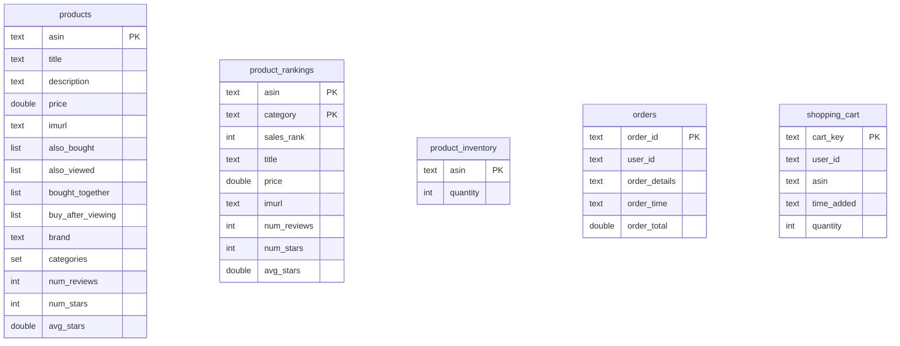

# テーブル一覧設計書

## 1. テーブル一覧表

| No. | テーブル名 | テーブル概要 |
|-----|-----------|-------------|
| 1 | orders | 注文情報を管理する |
| 2 | product_inventory | 商品の在庫数量を管理する |
| 3 | product_rankings | 商品のカテゴリ別売上ランキングを管理する |
| 4 | products | 商品の基本情報を管理する |
| 5 | shopping_cart | ショッピングカートの内容を管理する |

## 2. ER図

